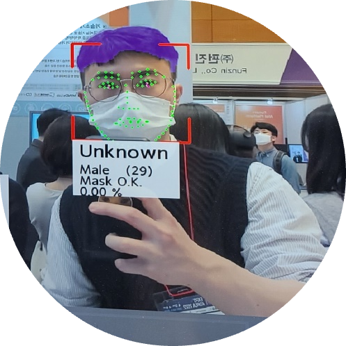
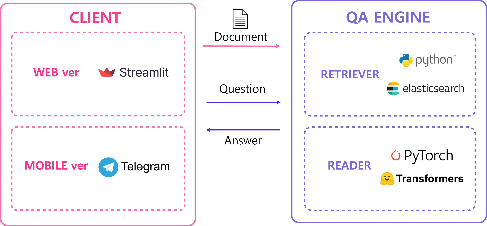
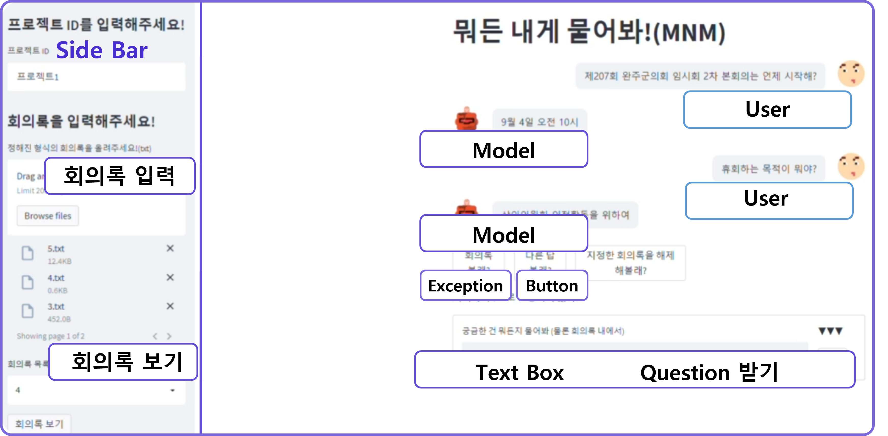
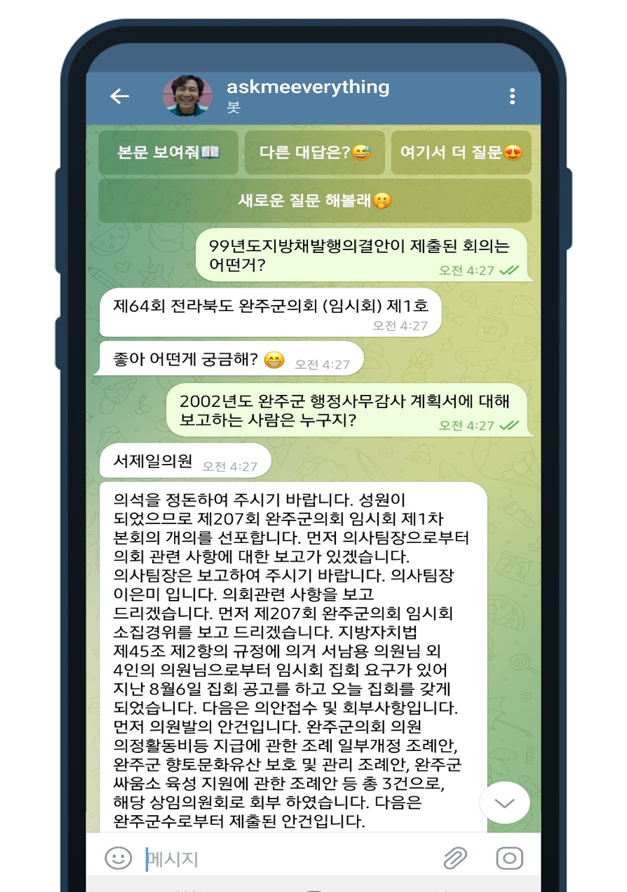
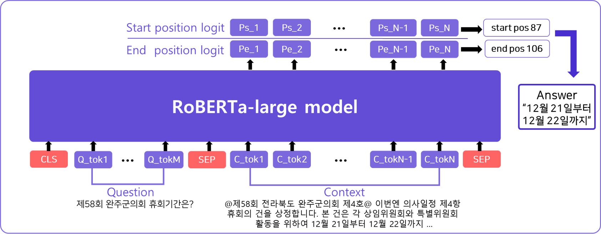
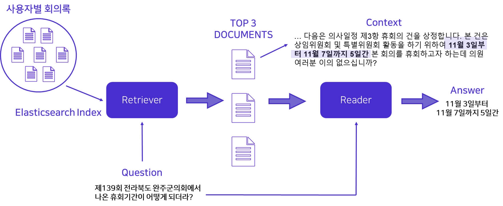

# ❓"뭐든 내게 물어봐!"❓
> 회의록을 활용한 Closed-Domain Question Answering(CDQA)

---

## Table of Contents
1. [Introduction]()
2. [Project Outline]()
3. [Demo]()
4. [Data]()
5. [Model]()
6. [How To Use]()
7. [References]()

---

## 1. Introduction
> 안녕하세요! 저희는 AI의 A부터 I까지 모든 것을 경험할 준비가 된 열정 가득한 사람들이 모인**MNM**팀 입니다! 


### Team MNM

> "**뭐**든 **내**게 **물**어봐!"

### Members
|김태일|문찬국|이재학|하성진|한나연|
|:-:|:-:|:-:|:-:|:-:|
[detailTales](https://github.com/detailTales)|[nonegom](https://github.com/nonegom)|[wogkr810](https://github.com/wogkr810)|[maxha97](https://github.com/maxha97)|[HanNayeoniee](https://github.com/HanNayeoniee)
|<a href="https://github.com/detailTales"></a>|<a href="https://github.com/nonegom"></a>|<a href="https://github.com/wogkr810"></a>|<a href="https://github.com/maxha97"></a>|<a href="https://github.com/HanNayeoniee"></a>|

### Contribution

| Member | Contribution | 
| --- | --- |
| 김태일 |  |
| 문찬국 |  |
| 이재학 |  |
| 하성진 |  |
| 한나연 |  |

## 2. Proeject Outline

> **프로젝트 주제** : 회의록을 활용한 Closed-Domain Question Answering(CDQA)

> **문제 정의**: 클로바 노트 등을 활용해 회의록을 쉽게 기록할 수 있게 됐지만, `정보 검색이 어렵다는 문제 발견`

> **개발 목표** : 사용자의 회의록 코퍼스에서 궁금한 질문을 주고 받을 수 있는 `회의록 QA` 모델 제작 

### **프로젝트 전체 구조** 



## 3. Demo

### 🖥️ Web 예시(Streamlit)



### 📱 App 예시(Telegram)




## 4. Data

> **Dataset** : [데이콘 회의 녹취록 요약 경진대회](https://dacon.io/competitions/official/235813/overview/description)의 의회 데이터를 이용하여 **직접 구축**

> **Annotation Tool** : [Haystack](https://annotate.deepset.ai/)을 이용하여 데이터셋 태깅

> **Guideline** : [Guideline 문서](https://docs.google.com/document/d/113ta_VFzTiys3pfLDbOLUC-Ecr3Z9fH0/edit?rtpof=true)에 **FAQ** 작성 및 **질문 유형화**

## 5. Model

### Reader
>🤗[RoBERTa-Large Finetuning Twice(KLUE MRC)](https://huggingface.co/Nonegom/roberta_finetune_twice)  
>🤗[Finetuning Our Dataset](https://huggingface.co/wogkr810/mnm)




### Retriever



## 6. How To Use

### Installation
- [Elasticsearch 설치](https://github.com/boostcampaitech3/final-project-level3-nlp-09/blob/develop/model/README.md)를 먼저 진행해 주세요!

```
# 파이썬 버전 확인 (3.8.5 확인)
python3 --version 

# venv 설치
sudo apt-get install python3-venv 

# 가상환경 생성하기
python3 -m venv [venv_name] 

# 가상환경 활성화(생성한 가상환경 폴더가 있는 경로에서 활성화 해야 함)
source [venv_name]/bin/activate 

# 라이브러리 설치
pip install -r requirements.txt

# 가상환경 종료
deactivate
```

### Streamlit
```
streamlit run main.py
```

### Telegram
```
# 텔레그램 공식 챗봇 생성 절차를 진행하여 토큰을 부여 받아, 관련 정보를 코드에 추가 후 실행  
python telegram_chatbot.py
```

## 7. References

### Commit Rule

```
- feat      : 새로운 기능 추가
- debug     : 버그 수정
- docs      : 문서 수정
- style     : 코드 formatting, 세미콜론(;) 누락, 코드 변경이 없는 경우
- refactor  : 코드 리팩토링
- test      : 테스트 코드, 리팩토링 테스트 코드 추가
- chore     : 빌드 업무 수정, 패키지 매니저 수정
- exp       : 실험 진행
- merge     : 코드 합칠 경우
- anno      : 주석 작업
- etc       : 기타
```

### Dataset
 >[데이콘 회의 녹취록 요약 경진대회](https://dacon.io/competitions/official/235813/overview/description)
- 라이센스 : ??

### Paper : 
> ~
### Software
>#### Reader : 
-
>#### Retriever : 
- 
> #### Frameworks : 
- [Stremlit](https://github.com/streamlit/streamlit)
- [Telegram](https://github.com/python-telegram-bot/python-telegram-bot)
